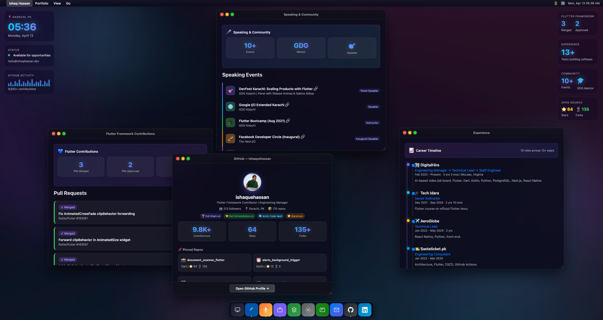

# ishaqhassan.dev

Personal portfolio website that replicates a full macOS desktop environment in the browser, with a native mobile app experience on phones.

<p align="center">
  
</p>

> **What's New** - Spotlight Search, Fullscreen Spaces, QuickTime Video Player, Show Desktop, Dynamic Menubar, Smart Window Tiling, and more. See the full [Changelog](CHANGELOG.md).

## Features

**Desktop (macOS Style)**
- Draggable, resizable windows with traffic light controls (all-edge resize, 8 directions)
- Spotlight Search (`Cmd+K`) across all windows, content, and 35 course videos
- Fullscreen Spaces with Mission Control integration (separate desktops per fullscreen app)
- Show Desktop (click wallpaper or F11, windows slide to nearest edge)
- Dynamic Menubar that updates per focused window (app name, contextual links)
- Smart window positioning (empty space first, auto-tile, cascade fallback)
- QuickTime-style video player with hover preview tooltips
- Interactive dock with magnification effect, auto-hide in fullscreen
- Live desktop widgets (clock, GitHub activity, stats)
- Terminal-style About window with typing animation
- Animated aurora borealis wallpaper with particle system
- Cursor spotlight that follows mouse movement
- 3D tilt effect and shine sweep on cards
- Noise texture overlay for depth
- Window state persistence (positions restored on reload)
- Video progress saved per video (resumes where you left off)

**Mobile (App Style)**
- Staggered hero entrance animation
- Glass morphism section cards with rotating gradient borders
- Scroll reveal animations with staggered timing
- Expandable detail views for each section
- Glowing stat pills with colored shadows
- Bottom social bar with quick links
- Animated number counters

**Content**
- Flutter framework contributions (6 merged, 3 open PRs into Flutter)
- 10+ speaking events at GDG, universities, conferences
- 16 professional roles across 13+ years
- 6 Medium articles on Flutter and Dart
- Open source projects (document_scanner_flutter, alarm plugin, etc.)
- Full tech stack showcase
- LinkedIn profile replica with tabbed navigation

**SEO**
- JSON-LD structured data (Person, WebSite, Events, Projects, Articles)
- Open Graph and Twitter Card meta tags
- sitemap.xml, robots.txt, manifest.json
- Hidden semantic HTML for search engine crawlers
- Keyword-optimized title, description, and meta tags

## Stack

- Pure HTML, CSS, JavaScript (no frameworks, no build step)
- Hosted on DigitalOcean (nginx + Let's Encrypt SSL)
- Cloudflare CDN, DDoS protection, email routing
- Domain: ishaqhassan.dev (Name.com + Cloudflare DNS)
- CI/CD: GitHub Actions auto-deploy on push to main

## Deploy

Pushes to `main` automatically deploy to the server via GitHub Actions.

```bash
git add . && git commit -m "update" && git push
```

## Local Dev

Just open `index.html` in a browser. No build tools needed.

## License

All rights reserved.
